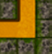

# MAZE-GENERATOR


  

Simple javascript class to generate mazes represented by arrays.  
Demo: https://jjcapellan.github.io/maze-generator/

## Features
* Two formats of maze: cells array or tiles array.
* Custom number of gates and position.
* Converter from cells to tiles.  

## Installation
There are two alternatives:
* Download the file [maze.min.js](https://cdn.jsdelivr.net/gh/jjcapellan/maze-generator/dist/maze.min.js) to your proyect folder and add a reference in your html:
```html
<script src = "maze.min.js"></script>
```
* Point a script tag to the CDN link:
```html
<script src = "https://cdn.jsdelivr.net/gh/jjcapellan/maze-generator/dist/maze.min.js"></script>
``` 
## How to use  
***
### Cells array
This is one possible graphic representation of a maze with only one cell (1x1 cells):  

  
Each cell is an array of four values (0 or 1) representing the walls: left, up, down, and right.  
The cells are grouped by rows.
In this minimal maze, left and upper walls are opened, so the method **Maze.cells()** returns:  
```
[
  [1,1,0,0]
]
```
For a maze of 10x10 cells:
```javascript
// Creates a maze object to make mazes of 10x10 cells
const maze = new Maze(10,10);
// Maze start in position: column 0, row 1
mymaze.gateway(0, 1);
// Maze exit in position: last column, row 7
mymaze.gateway(10 - 1, 7);
// Creates the array of rows of cells
let cells = maze.cells();
// Gets the cell at position: column 3, row 5
let cell = cells[5][3]

function render(cells){
    // Your code ...
}

```
Each time we call **Maze.cells()** it returns a new random maze.

### Tiles array
  

It is a 2d array. The above image is a cell of 3x3 tiles.  
Each tile is a single value 0 or 1. The tiles are grouped by rows.  
In this case the method **Maze.tiles()** returns:  
```
[
  [0,1,0],
  [1,1,0],
  [0,0,0]
]
```    

For a maze of 10x10 cells:
```javascript
// Creates a maze object to make mazes of 10x10 cells
const maze = new Maze(10,10);
// Maze start in position: column 0, row 1
mymaze.gateway(0, 1);
// Maze exit in position: last column, row 7
mymaze.gateway(10 - 1, 7);
// Creates the array of rows of tiles
let tiles = maze.tiles();
// Gets the tile at position: column 3, row 5
let tile = tiles[5][3]

function render(tiles){
    // Your code ...
}

```
Each time we call **Maze.tiles()** it returns a new random maze.

### Cells to Tiles conversion
The method **Maze.cellsToTiles(cellsArray)** converts a cells array into a tiles array.  
Example:
```javascript
const maze = new Maze(10,10);
// Creates the cells array
let cells = maze.cells();
// Returns a tiles array
let tiles = maze.cellsToTiles(cells);

```  

### Gateways
The method **Maze.gateway(columnX,rowY)** let us define new entries/exits from the maze. This method only accepts locations on the edge of the maze.

The gates are stored in **Maze.gates** array, and used each time a new maze is generated. The method **Maze.resetGates()** resets the gates array.  
Example:
```javascript
// Creates a maze object to make mazes of 10x10 cells
const maze = new Maze(10,10);
// Maze start in position: column 0, row 1
mymaze.gateway(0, 1);
// Maze exit in position: last column, row 7
mymaze.gateway(10 - 1, 7);
// Creates a maze of cells
let map1 = maze.cells();

// Clean the gates array
mymaze.resetGates();

// This time I only want one gate at: column 4, last row
mymaze.gateway(4, 9);

// Creates a new maze
let map2 = maze.cells();

```

## Dependencies
The Maze class uses plain javascript and not needs other libraries.  
For the demo was used the game framework [Phaser 3](https://phaser.io/) and the gui library [dat.GUI](https://github.com/dataarts/dat.gui).
